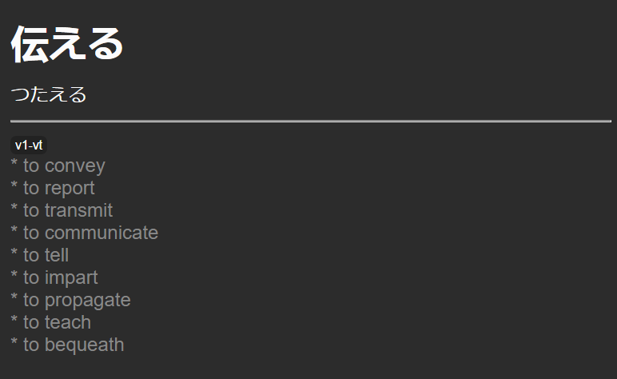

# AnkiDeckHelper

Allows you to create anki cards on batches, ordered by frequency and from definitions taken from JMDict.

You can
* Import your own lists of words
* Use frequency tables taken from Yomichan
* Create an Anki deck ready to import with definitions from JMDict

Card example:


# Prerequisites

* Docker
  * or, a local Ruby environment with an PSQL database

# Install

Download last JMDict JSON dictionary from
https://github.com/scriptin/jmdict-simplified/releases

Unzip/untar, place it under the `dictionaries` subfolder with the name `jmdict-eng-3.5.0.json`.

```
docker volume create --name=word-tracker-gems
docker-compose run app /bin/bash

bundle exec rails db:create
bundle exec rails db:migrate

# Enter console and run commands
bundle exec rails c
```

# Usage

```
# Load the dictionary
DictionaryImporter.new.call

# Load the frequency tables
FrequencyTableImporter.new('bccwj', 'frequency-tables/bccwj.json').call
FrequencyTableImporter.new('jpdb', 'frequency-tables/jpdb.json').call
FrequencyTableImporter.new('wikipedia', 'frequency-tables/wikipedia.json').call

# Import your lists of words
WordSetImporter.new('comprehensive-japanese', 'word-lists/comprehensive-japanese').call
WordSetImporter.new('kindle', 'word-lists/kindle').call
WordSetImporter.new('shirokuma-cafe', 'word-lists/shirokuma-cafe').call

# Calculate the frequency of words from a frequency list
FrequencyCalculator.new('bccwj', Word.all).call
FrequencyCalculator.new('jpdb', Word.all).call
FrequencyCalculator.new('wikipedia', Word.all).call

# Order the words considering one or more frequency tables
words_with_frequency = WordPriorityEstimator.new(Word.all, FrequencyTable.all).call

# Use this to get the word objects back from words_with_frequency
words = words_with_frequency.map(&:word)

# Create an anki deck from a list of words named "my_deck"
# Deck will be created into the "decks" subfolder
AnkiDeckGenerator.new(words, 'my_deck').call

```

To destroy things
```
Dictionary::Meaning::Definition.delete_all
Dictionary::Meaning::Field.delete_all
Dictionary::Meaning::MiscTag.delete_all
Dictionary::Meaning::PartOfSpeech.delete_all
Dictionary::Meaning.delete_all
Dictionary::Reading.delete_all
Dictionary::Entry.delete_all
```

Styling used for the cards
```
.card {
  font-family: arial;
  font-size: 20px;
  text-align: left;
  color: #222;
  background-color: white;
}

.reading{
  display: inline;
}

.h1 {
  font-family: arial;
  font-size: 30px;
  text-align: center;
  color: black;
  background-color: white;
}

.definition {
  display: inline;
  color: #888;
}

.tags {
  font-size: 13px;
  background: #222;
  display: inline-block;
  padding: 2px 5px;
  border-radius: 6px;
  text-align: center;
}
```
