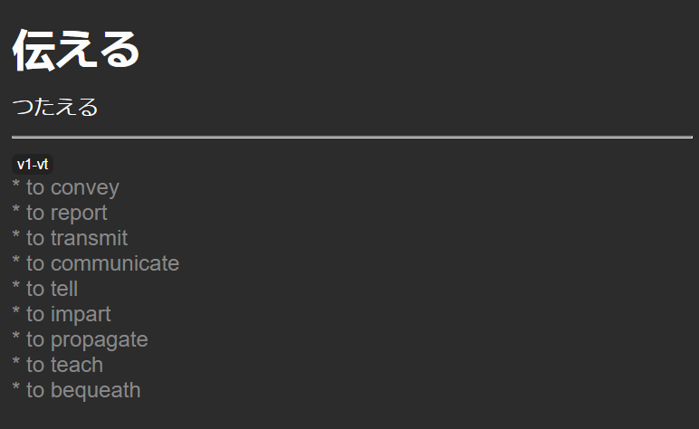

# AnkiDeckHelper

Allows you to create anki cards on batches, ordered by frequency and from definitions taken from JMDict.

You can
* Import your own lists of words
* Use frequency tables taken from Yomichan
* Create an Anki deck ready to import with definitions from JMDict

Card example:


## Technology stack

| Layer | Technologies |
|---|---|
| Backend | Ruby 3.2, Rails 7, PostgreSQL 15 |
| Frontend | React 19, TypeScript, Vite 6, Tailwind CSS 4 |
| API | JSON under `/api/v1/*` (Jbuilder) |
| Infra | Docker Compose (`postgres`, `app`, `frontend`) |

## Development

The app runs via Docker Compose. In development, the React frontend is available at [http://localhost:5173/](http://localhost:5173/) (Vite dev server). The Rails API listens on port 3000; the frontend proxies `/api` requests to it.

This project is developed with [Cursor](https://cursor.com/). AI-assisted conventions and commands live in `.cursor/rules/` and `AGENTS.md`.

### Word definitions by language

On the word detail page, dictionary definitions are shown for a selected language. English (`en`) is the default for guests.

- Import glossaries per language (for example JMDict English via `DictionaryImporter`, or Wiktionary Japanese via `WiktionaryDictionaryImporter`).
- `GET /api/v1/words/:id?language=en` returns `dictionary_entries` for the requested language and `available_languages` listing every language that has definitions for that word.
- The frontend shows a language picker when more than one language is available; changing the selection refetches definitions for that language.
- Signed-in users can set a preferred definition language under **Preferences**; word pages use that language by default instead of `en`.

### Authentication

Users can register and log in from the top bar. The API uses Devise with JWT bearer tokens.

| Method | Path | Description |
|--------|------|-------------|
| POST | `/api/v1/auth/signup` | Register (`email`, `username`, `password`, `password_confirmation`) |
| POST | `/api/v1/auth/login` | Log in (`email`, `password`) — returns JWT in `Authorization` header |
| GET | `/api/v1/auth/me` | Current user (requires JWT) |
| DELETE | `/api/v1/auth/logout` | Revoke JWT |
| GET/PATCH | `/api/v1/users/preferences` | Read/update `preferred_language` |

Passwords must be at least 8 characters and include one uppercase letter and one special character.

Set `DEVISE_JWT_SECRET_KEY` in production (development/test use a default).

# Prerequisites

* Docker
  * or, a local Ruby environment with an PSQL database

# Install

Download last JMDict JSON dictionary from
https://github.com/scriptin/jmdict-simplified/releases

Unzip/untar, place it under the `dictionaries` subfolder with the name `jmdict-eng-3.5.0.json`.

For Japanese definitions from Wiktionary, place a kaikki.org JSONL extract under `dictionaries/`
(for example `dictionaries/ja-extract.jsonl`).

```
docker volume create --name=word-tracker-gems
docker-compose run app /bin/bash

bundle exec rails db:create
bundle exec rails db:migrate

# Enter console and run commands
bundle exec rails c
```

# Usage

```
# Load the JMDict dictionary (English definitions)
DictionaryImporter.new.call(language: :en, file: 'dictionaries/jmdict-eng-3.5.0.json')

# Load a Wiktionary JSONL extract (Japanese definitions)
WiktionaryDictionaryImporter.new.call(language: :ja, file: 'dictionaries/ja-extract.jsonl')

# Assign existing meanings to the English dictionary (after upgrading)
bundle exec rails dictionary:assign_english_dictionary

# Load the frequency tables
FrequencyTableImporter.new('bccwj', 'frequency-tables/bccwj.json').call
FrequencyTableImporter.new('jpdb', 'frequency-tables/jpdb.json').call
FrequencyTableImporter.new('wikipedia', 'frequency-tables/wikipedia.json').call

# Import your lists of words
WordSetImporter.new('comprehensive-japanese', 'word-lists/comprehensive-japanese').call
WordSetImporter.new('kindle', 'word-lists/kindle').call
WordSetImporter.new('shirokuma-cafe', 'word-lists/shirokuma-cafe').call

# Import word sets from a Takoboto CSV export (one WordSet per List column)
TakobotoWordSetImporter.new('word-lists/takoboto-export.csv').call

# Calculate the frequency of words from a frequency list
FrequencyCalculator.new('bccwj', Word.all).call
FrequencyCalculator.new('jpdb', Word.all).call
FrequencyCalculator.new('wikipedia', Word.all).call

# Order the words considering one or more frequency tables
words_with_frequency = WordPriorityEstimator.new(Word.all, FrequencyTable.all).call

# Use this to get the word objects back from words_with_frequency
words = words_with_frequency.map(&:word)

# Create an anki deck from a list of words named "my_deck"
# Deck will be created into the "decks" subfolder
english_dictionary = Dictionary.find_by!(name: 'jmdict-eng-3.5.0', language: Language.find_by!(code: 'en'))
AnkiDeckGenerator.new(words, 'my_deck', dictionary: english_dictionary).call

```

Remove words from other word sets
```
other_words = (WordSet.find(1).words.distinct + WordSet.find(2).words.distinct + WordSet.find(3).words.distinct).uniq; 1

final_words = (words - other_words); 1
```

To destroy things
```
Dictionary::Meaning::Definition.delete_all
Dictionary::Meaning::Field.delete_all
Dictionary::Meaning::MiscTag.delete_all
Dictionary::Meaning::PartOfSpeech.delete_all
Dictionary::Meaning.delete_all
Dictionary::Reading.delete_all
Dictionary::Entry.delete_all
Dictionary.delete_all
Language.delete_all
```

Styling used for the cards
```
.card {
  font-family: arial;
  font-size: 20px;
  text-align: left;
  color: #222;
  background-color: white;
}

.reading{
  display: inline;
}

.h1 {
  font-family: arial;
  font-size: 30px;
  text-align: center;
  color: black;
  background-color: white;
}

.definition {
  display: inline;
  color: #888;
}

.tags {
  font-size: 13px;
  background: #222;
  display: inline-block;
  padding: 2px 5px;
  border-radius: 6px;
  text-align: center;
}
```

## Export to Kotoba bot format

Export a CSV to be used for Kotoba's Discord bot (https://kotobaweb.com/bot)

```
# Create an Kotoba CSV deck from a list of words named "kotoba_my_deck"
# Deck will be created into the "decks" subfolder
KotobaDeckGenerator.new(words, 'my_deck', dictionary: english_dictionary).call
```

## Export to Javascript Array format

Export a File to be used for the simple SRS application (https://leo-flashcards.netlify.app/)

```
# Create an Kotoba CSV deck from a list of words named "javascript_my_deck"
# Deck will be created into the "decks" subfolder
JavascriptDeckGenerator.new(words, 'my_deck', dictionary: english_dictionary).call
```